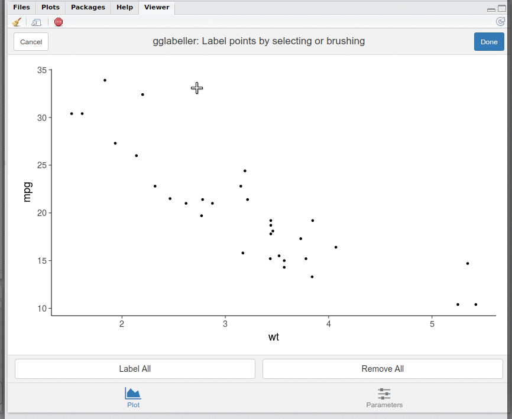
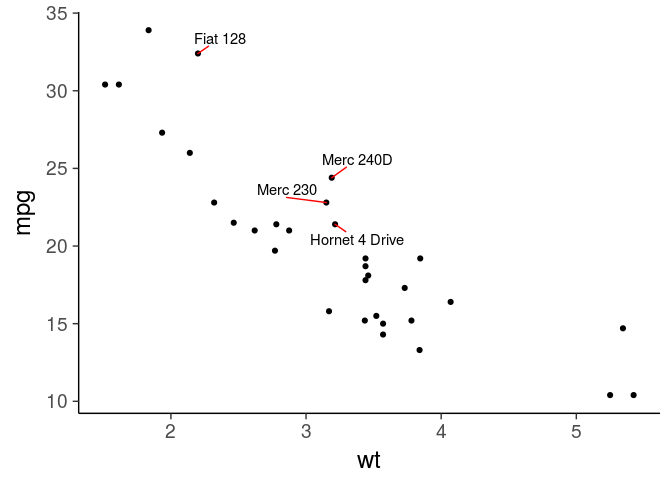

<!-- README.md is generated from README.Rmd. Please edit that file -->
gglabeller
==========

R package with one main function, gglabeller, which launches a simple shiny gadget that enables selecting points on a ggplot to label. Label positions are determined using the fantastic [ggrepel](www.github.com/slowkow/ggrepel) package.

Installation
============

At the moment, depends on development version of ggrepel. Installation via devtools:

``` r
devtools::install_github("slowkow/ggrepel") # Install development version
devtools::install_github("AliciaSchep/gglabeller") 
```

Usage
=====

First create a plot using ggplot2 and save it to a variable:

``` r
library(gglabeller)
library(ggplot2)
library(ggrepel)

p <- ggplot(mtcars, aes(x = wt, y = mpg)) + geom_point() + 
            theme_classic(base_size = 18)
```

Pass the variable to gglabeller:

``` r
gglabeller_example <- gglabeller(p, aes(label = rownames(mtcars)))
```

Running gglabeller will open a shiny gadget in the RStudio viewer pane (or in the browser if running R in the terminal). You can click or brush over points to select them for labelling. Clicking over an already labelled point or brushing over a set of points that have all been labelled will remove the labels.



You can also modify the ggrepel parameters via the "Parameters" tab in the app.


After clicking done, the returned object is a list storing the resulting plot and a code snippet for recreating the plot de novo.

We can make a static version of the plot to save:

``` r
gglabeller_example$plot
```


The code snippet can be useful if you want to incorporate the plot creation into a reproducible script:

``` r
gglabeller_example$code
#> [1] "set.seed(1502996);gglabeller_data <- p$data; gglabeller_data$gglabeller_labels <- rownames(mtcars); gglabeller_data[c(1:3, 5:7, 10:17, 19:32),'gglabeller_labels'] <- ''; p + geom_text_repel(data = gglabeller_data,mapping = aes(label = gglabeller_labels), segment.color = 'red',box.padding = unit(0.5, 'lines'))"
```

``` r
library(magrittr)
gglabeller_example$code %>% parse(text = .) %>% eval()
```



Limitations
===========

Requires points to label; not targetted at line plots or other non-point plots.
